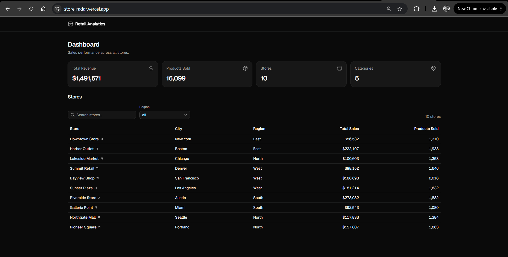
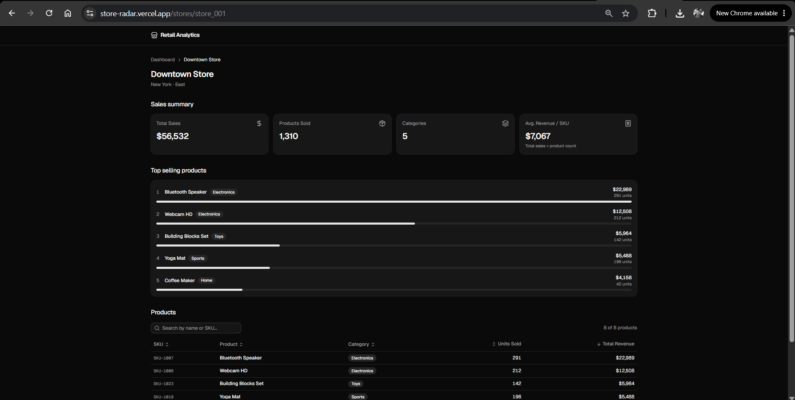
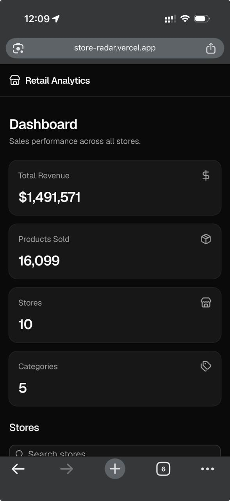

# 📊 Retail Analytics Dashboard

A modern sales analytics dashboard built with **Next.js**, **React**, **TypeScript**, **Tailwind CSS**, and **TanStack Query**.

This project was designed as a production-quality frontend application that demonstrates scalable architecture, clean code practices, and modern UI development.

**🔗 Live demo:** [store-radar.vercel.app](https://store-radar.vercel.app)

---

## ✨ Features

- 📈 Sales dashboard
- 🏬 Store listing
- 🔍 Search stores
- 🌎 Filter by region
- 📊 Store sales summary
- 🏆 Top 5 best-selling products
- 📋 Sortable products table
- 🔎 Search products by name or SKU
- ⚡ Mock REST API using Next.js Route Handlers
- 📱 Fully responsive
- ♿ Accessible UI
- 🌙 Dark UI by default

---

## 🛠 Tech Stack

| Technology | Purpose |
|------------|---------|
| Next.js 16 | React Framework |
| React 19 | UI Library |
| TypeScript | Static typing |
| Tailwind CSS | Styling |
| shadcn/ui | UI Components |
| TanStack Query | Server state |
| TanStack Table | Data tables |
| Zod | Validation |
| Lucide React | Icons |
| Vitest + RTL | Testing |

---

## 🏗 Architecture

This project follows a **Feature-Driven + Layered Architecture**.

```text
src/

app/
features/
components/
services/
hooks/
providers/
schemas/
types/
utils/
constants/
```

Business logic is isolated from the UI.

Components are reusable.

Data fetching is abstracted through Services and TanStack Query.

---

## 📁 Project Structure

```text
.
├── docs/
│   ├── 01-PRD.md
│   ├── 02-TECH-STACK.md
│   ├── 03-ARCHITECTURE.md
│   ├── 04-DATABASE.md
│   ├── 05-API.md
│   ├── 06-UI-GUIDELINES.md
│   └── 07-TASKS.md
│
├── src/
│
├── public/
│
└── CLAUDE.md
```

---

## 🚀 Getting Started

### Install dependencies

```bash
npm install
```

### Run development server

```bash
npm run dev
```

Open:

```text
http://localhost:3000
```

---

## 📂 Mock API

The application uses a local Mock API implemented with Next.js Route Handlers.

Available endpoints:

```http
GET /api/stores

GET /api/stores/:id

GET /api/products

GET /api/regions

GET /api/overview
```

All responses are validated using Zod before being consumed by the application.

---

## 📊 Data Model

The application uses a normalized domain model.

```text
Store

↓

StoreProductSales

↓

Product
```

Dashboard metrics are calculated dynamically.

No derived values are persisted.

---

## 🎨 UI Design

Inspired by:

- Vercel
- Linear
- Stripe Dashboard
- GitHub
- shadcn/ui

Design principles:

- Clean
- Minimal
- Accessible
- Responsive
- Data-first

---

## 📱 Responsive

Supports:

- 📱 Mobile
- 💻 Tablet
- 🖥 Desktop

Built with a Mobile-First approach.

---

## ♿ Accessibility

The project follows accessibility best practices.

- Semantic HTML
- Keyboard navigation
- Focus management
- WCAG-friendly color contrast
- Accessible labels

---

## 📦 Available Scripts

```bash
npm run dev

npm run build

npm run lint

npm run type-check

npm run test

npm run test:coverage
```

---

## 🧪 Testing

Unit and integration tests use **Vitest** and **React Testing Library**.

```bash
npm run test

npm run test:coverage
```

Coverage focuses on the critical logic: services, the API client, utilities, the debounce hook and reusable components.

---

## 🧠 Engineering Principles

This project follows:

- Clean Code
- SOLID
- DRY
- KISS
- Composition over Inheritance
- Single Responsibility Principle

---

## 📄 Documentation

Complete project documentation is available in the `docs/` directory.

- PRD
- Tech Stack
- Architecture
- Database Design
- API Specification
- UI Guidelines
- Development Tasks

---

## 📸 Screenshots

### Dashboard



### Store Detail



### Mobile View



---

## 🚀 Future Improvements

- Authentication
- Real Backend API
- Pagination
- Export to CSV
- Charts
- Sales trends
- Inventory module
- User roles
- Settings

---

## 👨‍💻 Author

**Edgar Reyes** — [@iEdgar](https://github.com/iEdgar)

Developed as a professional frontend engineering project focused on scalable architecture and modern development practices.
